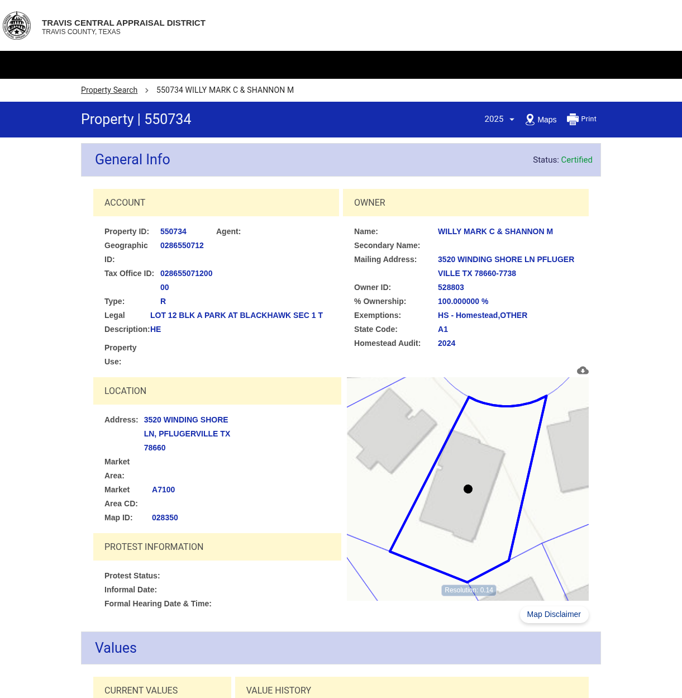

# 3520 Winding Shore Lane, Pflugerville TX 78660

## Property Details

| Field | Value |
|-------|-------|
| **PropID** | 550734 |
| **Owner** | WILLY MARK C & SHANNON M |
| **2025 Appraisal** | $378,041 |
| **Mailing Address** | 3520 WINDING SHORE LN PFLUGERVILLE TX 78660-7738 |
| **Deed Instrument** | 2003222117TR (Warranty Deed, 9/12/2003) |
| **Property Type** | R (Residential) |
| **Square Footage** | 1,892 sqft (Main) + 432 sqft (Garage) = 2,324 sqft total |
| **Year Built** | 2003 |
| **Land Area** | 0.2065 acres (8,993 sqft) |
| **Improvement Value** | $330,798 |
| **Land Value** | $47,243 |

## Value History

| Year | Land Market | Improvement | Appraised | Net Appraised |
|------|-------------|-------------|-----------|---------------|
| 2025 | $47,243 | $330,798 | $378,041 | $378,041 |
| 2024 | $45,000 | $336,280 | $381,280 | $358,779 |
| 2023 | $45,000 | $391,244 | $436,244 | $326,163 |
| 2022 | $45,000 | $384,280 | $429,280 | $296,512 |
| 2021 | $45,000 | $228,206 | $273,206 | $269,556 |

## Taxing Units

| Unit | Description | Net Appraised | Taxable Value |
|------|-------------|---------------|---------------|
| 03 | TRAVIS COUNTY | $378,041 | $159,213 |
| 0A | TRAVIS CENTRAL APP DIST | $378,041 | $378,041 |
| 19 | PFLUGERVILLE ISD | $378,041 | $168,941 |
| 2J | TRAVIS COUNTY HEALTHCARE DISTRICT | $378,041 | $117,233 |
| 9B | TRAVIS CO ESD NO 2 | $378,041 | $378,041 |
| 9H | LAKESIDE WCID NO 2B | $378,041 | $278,041 |

## Property Features

- **Foundation:** SLAB
- **Roof Covering:** COMPOSITION SHINGLE
- **Roof Style:** HIP
- **Grade Factor:** A

## Deed History

| Date | Type | Grantor | Grantee | Instrument |
|------|------|---------|---------|------------|
| 2003-09-12 | WD | CAPITAL PACIFIC HOLDINGS LLC | WILLY MARK C & SHANNON M | 2003222117TR |
| 2002-12-13 | SW | RH OF TEXAS LP | CAPITAL PACIFIC HOLDINGS LLC | 2002248165TR |

## Google Drive Folder

https://drive.google.com/drive/folders/1K0v6_bPfwpJ11uys6RgyjTDKv4B5LOgf

## TCAD Screenshot

